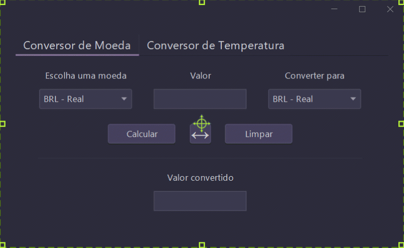

<h2 align='center'>Challenge ONE Back End - Sprint 01</h2>

  <a href='#-desafio'>Desafio</a> |
  <a href='#-preview'>Preview</a> |
  <a href='#-melhorias'>Melhorias</a> |
  <a href='#-tecnologias'>Tecnologias</a> |
  <a href='#-projeto'>Projeto</a>

## 🏆 Desafio

O desafio proposto pela Alura foi a criação de um conversor de moeda, utilizando a linguagem Java. As funções solicitadas para serem realizadas pelo conversor são:

- Converter de Reais a Dólar Americano
- Converter de Reais a Euro
- Converter de Reais a Libra
- Converter de Reais a Peso Argentino
- Converter de Reais a Peso Chileno

Também deve ser possível converter de forma inversa. Além disso, foi incentivada a criação de algum conversor adicional.

## 🎥 Preview

## 🔨 Melhorias

Além das especificações originais do desafio, foram feitas algumas melhorias, como a criação de outro conversor que trabalha com as principais unidades de medida de temperatura, que são `Celsius`, `Kelvin` e `Fahrenheit`. No conversor de moedas, foram adicionadas mais algumas opções, sendo elas:

- Iene Japonês
- Yuan Chinês
- Peso Mexicano
- Peso Uruguaio
- Peso Cubano

## 💻 Tecnologias

As tecnologias usadas nesse projeto foram:

- `Linguagem`: Java 19
- `IDE`: IntelliJ IDEA
- `Interface Gráfica`: Swing com FlatLaf
- `Gerenciador`: Maven
- `API`: [APILayer - Exchange Rates Data](https://apilayer.com/marketplace/exchangerates_data-api)

## 📜 Projeto

Para acessar o projeto basta baixar e abrir o arquivo [Conversor.jar](https://github.com/GusBuz/Conversor-ONE/blob/main/out/artifacts/Conversor.jar?raw=true). (É necessário ter o JRE instalado no seu computador para rodar.)
